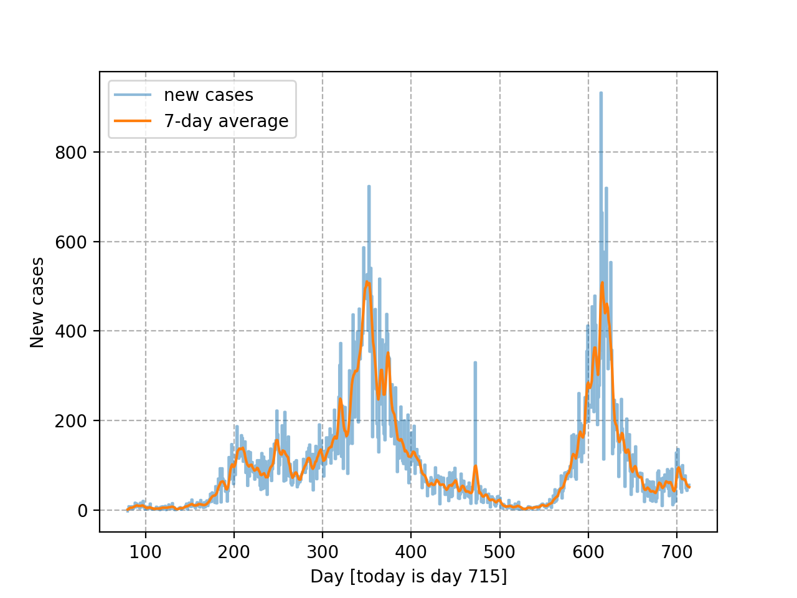
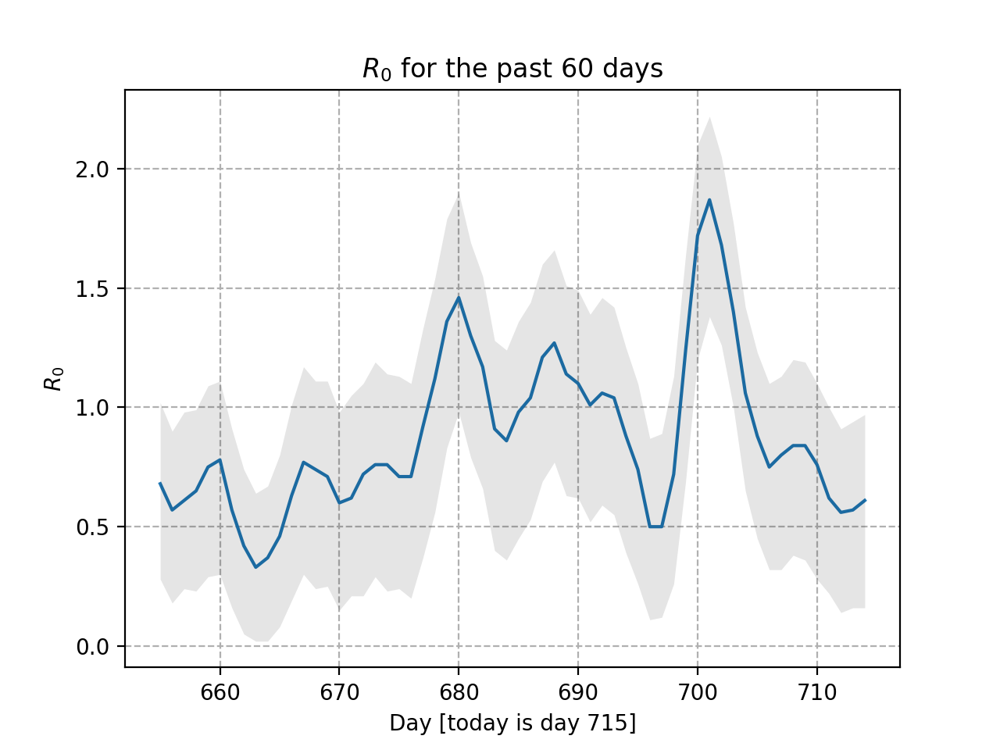

# Knox County COVID-19 data
This calculation of R_0 is based on the original code found here: https://github.com/k-sys/covid-19

The bayesian method used is described in this paper: https://journals.plos.org/plosone/article?id=10.1371/journal.pone.0002185 

The data is extracted from https://covid.knoxcountytn.gov/case-count.html

These figures are set up to refresh every day at 11:05 am.

